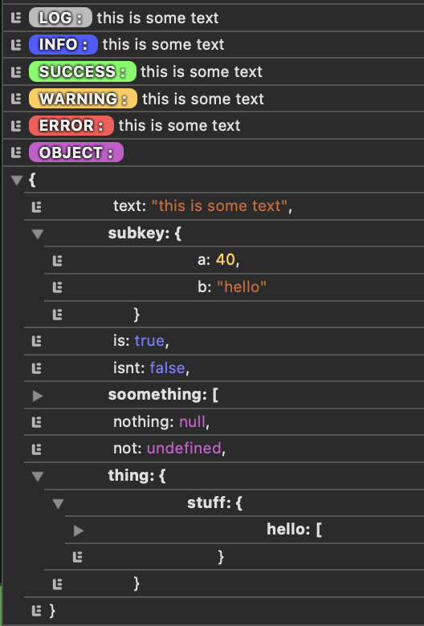

# pretty-browser-logger
## the object parsing sucks. Why would you log an object like this anyway? Meh, it's pretty

do this

```javascript
    logger.log(`this is some text`)
    logger.info(`this is some text`)
    logger.success(`this is some text`)
    logger.warn(`this is some text`)
    logger.error(`this is some text`)
    logger.object({
        text: `this is some text`,
        subkey: {
            a: 40,
            b: 'hello'
        },
        is: true,
        isnt: false,
        soomething: [
            4, 3, "no"
        ],
        nothing: null,
        not: undefined,
        thing: {
            stuff: {
                hello: [1, 2, 3, 4]
            }
        }
    })
```

and you'll get this


